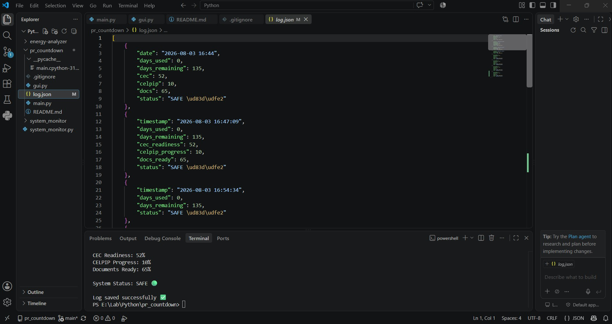

# 🚀 PR Countdown Dashboard

## 🖥️ Preview



---

A Python-based dashboard to track immigration progress, countdown deadlines, and monitor key KPIs in real-time.

---

## 🔥 Features

- ⏳ Real-time PR countdown  
- 📊 KPI tracking (CEC, CELPIP, Documents)  
- ⚠️ Smart status engine (SAFE / WARNING / CRITICAL)  
- 🖥️ GUI dashboard (Tkinter)  
- 📝 Daily logging system (JSON)  

---

## 🛠 Tech Stack

- Python 3.14  
- Tkinter (GUI)  
- JSON (Data Storage)  

---

## ▶️ How to Run

```bash
python main.py
